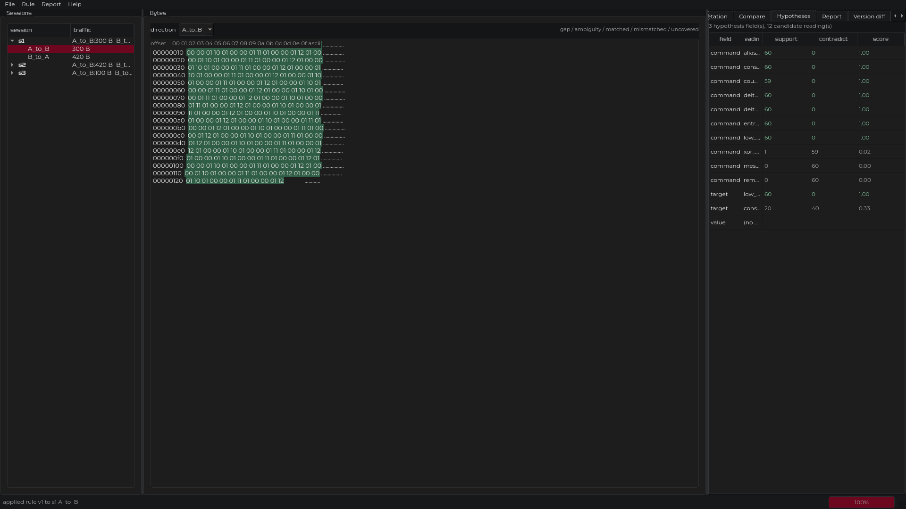
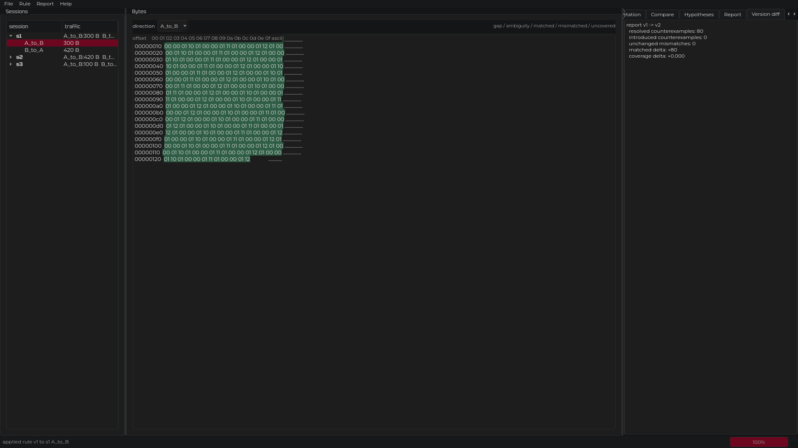
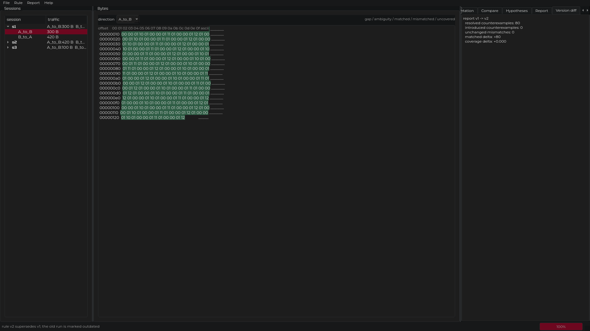
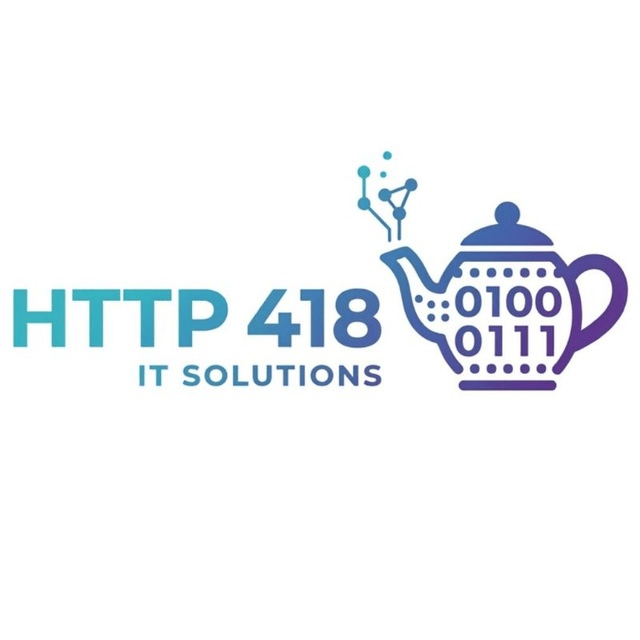

# Инструмент исследования бинарного протокола поверх TCP

Настольное приложение для разбора недокументированного бинарного протокола
поверх TCP. Оно открывает захват трафика формата PCAP или PCAPNG, выделяет
TCP-сессии, собирает направленные потоки, показывает байты с привязкой к
пакетам, позволяет выдвигать гипотезы о структуре сообщений, применять
декларативные правила интерпретации, проверять их на корпусе, находить
контрпримеры и сохранять всё исследование переносным проектом с отчётом.

Главный принцип: факт и догадка не смешиваются. Каждый диапазон байт в
восстановленном потоке связан с породившим его пакетом; пропуск или
неоднозначное наложение показываются как есть, а не заполняются; правило,
согласованное с примерами, считается подтверждённым в проверенном объёме, а не
доказанным.

Интерфейс доступен на русском и английском языке (переключается в меню языка,
выбор запоминается) и в тёмной и светлой теме (меню «Вид», тёмная по умолчанию).
Все команды работают офлайн.

## Реализованная функциональность

- **Чтение захватов.** PCAP и PCAPNG, включая несколько блоков интерфейса,
  разные типы канального уровня и разбор временных меток.
- **TCP-сессии.** Идентификация соединений по четвёркам адрес/порт, отслеживание
  открытия, закрытия (FIN) и сброса (RST), порядок потоков.
- **Потоковая сборка.** Восстановление каждого направления по номерам
  последовательности, диагностика пропусков и неоднозначных перекрытий,
  отметка повторных передач.
- **Привязка к пакетам.** Для каждого байта восстановленного потока хранится
  ссылка на исходный пакет (номер, файл, смещение, временная метка).
- **Нормализованный экспорт.** Единый JSON-контракт между всеми стадиями
  (`docs/CONTRACT.md`), пригодный для внешних инструментов.
- **Потоковый режим.** Нормализация больших захватов без удержания всего файла
  в памяти.
- **Экспорт в Wireshark.** Запись восстановленных потоков обратно в pcap.
- **Фрейминг сообщений.** Несколько стратегий выделения границ сообщений
  (по префиксу длины, разделителю, фиксированному размеру, длине с конца).
- **Декларативные правила.** Описание структуры сообщения в версионируемом
  формате; движок применяет правило ко всему потоку или корпусу и выдаёт
  машинно-читаемый результат.
- **Проверка и контрпримеры.** Сверка правила с корпусом, классификация
  сообщений (`matched`, `mismatched`, `incomplete`, `uncovered`), показ
  конкретных байт, опровергающих гипотезу.
- **Версионирование.** Правила и результаты версионируются; поддерживается
  сравнение двух версий правила и двух результатов.
- **Альтернативные гипотезы.** Панель гипотез оценивает конкурирующие прочтения
  полей по всему корпусу, а не по отдельному примеру.
- **Переносной проект.** Исследование сохраняется на диск каталогом с манифестом
  (относительные пути и sha256), экспортируется и импортируется zip-архивом с
  проверкой целости.
- **Отчёты.** Исследование отрисовывается в Markdown и в самодостаточную
  HTML-страницу.
- **Графический интерфейс.** Дерево сессий, шестнадцатеричный вид с привязкой к
  пакетам, сравнение сообщений, панель правила и валидации, панель гипотез,
  сравнение версий, диалог настроек.
- **Интерфейс и темы.** Русский и английский язык, тёмная и светлая тема,
  размеры шрифтов, каталоги по умолчанию и уровень логирования — в диалоге
  настроек.
- **Веб-интерфейс (необязательно).** Локальная страница поверх тех же движков:
  сессии, шестнадцатеричный вид с вердиктами, применение правила, провенанс
  байта, экспорт HTML-отчёта. Только `127.0.0.1`, состояние в памяти.

## Особенность проекта в следующем

1. **Байт всегда связан с пакетом.** Привязка провенанса не надстройка, а
   свойство самой модели потока: любой байт можно раскрыть до пакета, из
   которого он пришёл. Это делает вывод проверяемым, а не правдоподобным.
2. **Совпадение не считается доказательством.** Правило, согласованное со всеми
   примерами, отчитывается как подтверждённое в проверенном объёме. Корпус
   целенаправленно содержит контрпример — команду, которую узкое правило v1 не
   допускало и которая уточнила правило до v2.
3. **Пропуск виден, а не заполнен.** Пропуски и неоднозначные перекрытия в
   потоке не маскируются: они показываются отдельными категориями с координатами
   и остаются входными данными для следующего шага.

## Основной стек технологий

| Слой | Технологии |
| --- | --- |
| Язык | Python 3.12+ |
| Интерфейс | PySide6 6.8.1 (Qt 6), свой набор токенов темы, шрифты Tektur и Montserrat |
| Разбор захватов | dpkt 1.9.8 |
| Конфигурация правил | JSON, JSON Schema (`jsonschema`) |
| Тесты | pytest, pytest-cov |
| Качество кода | ruff |
| Сборка | setuptools, PyInstaller, dpkg-deb, Docker |

Графический интерфейс, разбор захватов, движок правил и отчёты не зависят от
сторонних сетевых сервисов: приложение полностью локальное.

## СРЕДА ЗАПУСКА

- **Операционная система:** Linux x86-64.
- **Python:** 3.12 или новее.
- **Графическая среда:** требуется для окна; движок и командные интерфейсы
  работают без графики.
- **Ресурсы под эталонную нагрузку** (PCAP до 100 МиБ, 250k пакетов, 1000
  TCP-сессий, 100k сообщений, ответы до 64 КиБ): 4 vCPU и 8 ГБ ОЗУ. Измеренные
  значения — в `docs/BENCHMARK.md`.
- **Сеть:** все команды выполняются офлайн.

## УСТАНОВКА

### Установка пакета и утилит

Выполните:

```
sudo apt-get update
sudo apt-get upgrade
sudo apt-get install -y python3.12 python3.12-venv git
git clone https://github.com/Pavel1778/madrigal-protocol-lab
cd madrigal-protocol-lab
```

### Установка зависимостей проекта

Зависимости ставятся через виртуальное окружение Python:

```
python3.12 -m venv .venv
source .venv/bin/activate
pip install --upgrade pip
pip install -e ".[dev]"
```

### Подготовка тестовых данных

Корпус и синтетические фикстуры детерминированы и собираются одной командой:

```
python -m scripts.generate_corpus
```

Команда пишет корпус в `tests/corpus/` и фикстуры в `tests/fixtures/`.

## Пример запуска

### Командная строка

Нормализация захвата:

```
python -m src.capture.cli --pcap tests/corpus/corpus_capture_01.pcapng \
  --out out/cap01.json --source-name captures/corpus_capture_01.pcapng
```

Полный конвейер (захват → проект → отчёт):

```
python -m src.project.cli pipeline \
  --pcap tests/corpus/corpus_capture_01.pcapng \
  --project project.lab --report REPORT.md
```

Флаг `--verbose` включает журнал чтения, сессий и экспорта в stderr; без него
интерфейсы командной строки молчат.

### Графический интерфейс

```
python -m src.ui.main_window \
  --capture tests/corpus/reference_export/corpus_capture_01.normalized.json \
  --rule examples/corpus_rule_v1.json
```

Настройки открываются через **Вид → Настройки…** или **Ctrl+,**. При чтении
потока **Ctrl +** (или **Ctrl =**) и **Ctrl −** увеличивают и уменьшают байты и
дерево сессий, **Ctrl 0** возвращает исходный размер.

### Веб-интерфейс (необязательно)

Дополнительно есть локальная веб-страница поверх тех же движков захвата и правил.
Основным остаётся окно PySide6; веб-слой лишь оборачивает `src.capture` и
`src.protocol` и не содержит собственной логики протокола.

```
pip install -e ".[web]"
python -m src.web.app \
  --capture tests/corpus/reference_export/corpus_capture_01.normalized.json \
  --rule examples/corpus_rule_v1.json --port 8765
```

Откройте <http://127.0.0.1:8765>. Сервер слушает только `127.0.0.1`, всё
состояние держит в памяти, базы данных нет. Страница показывает список сессий,
шестнадцатеричный вид с подсветкой вердиктов, применение правила, провенанс
каждого байта и экспорт самодостаточного HTML-отчёта. Подробности и осознанно
исключённый объём — в [docs/WEB.md](docs/WEB.md).

### Тесты

```
pytest tests/ -q
```

## Структура проекта

- `src/capture/` — чтение PCAP/PCAPNG, TCP-сессии, сборка потоков, провенанс
- `src/protocol/` — фрейминг и движок правил
- `src/hypothesis/` — классификация результатов, проверка на корпусе, версии
- `src/ui/` — интерфейс на PySide6
- `src/project/` — переносной проект на диске
- `src/report/` — отчёты об исследовании
- `src/web/` — необязательный локальный веб-интерфейс (FastAPI + HTMX)
- `scripts/` — детерминированные генераторы и бенчмарки
- `docs/` — контракты, схемы, заметки по API, стиль, бенчмарк
- `tests/fixtures/` — небольшие синтетические захваты, по одному поведению
- `tests/fixtures/defects/` — намеренно повреждённые захваты
- `tests/corpus/` — исследовательский корпус и его эталонный экспорт
- `tests/integration/` — прогон корпуса от начала до конца
- `presentation/` — материалы демонстрации и реальные снимки окна

## Как пользоваться

### Сценарий 1. От захвата к нормализованному JSON

1. Соберите тестовые данные: `python -m scripts.generate_corpus`.
2. Нормализуйте захват командой из раздела «Пример запуска».
3. Сверьте результат с контрактом `docs/CONTRACT.md` и схемами в `docs/schemas/`.

Окно со списком сессий:


### Сценарий 2. От гипотезы к правилу и контрпримеру

1. Откройте окно с первым правилом `examples/corpus_rule_v1.json`.
2. Перейдите на вкладку «Интерпретация»: видно `matched` и `mismatched`.
3. Изучите контрпример — конкретные байты, опровергающие узкое правило.



Точность узкого правила v1: 0.43 (60 support, 80 contradict). Уточнённое правило
v2 на том же корпусе: 140 matched, 0 mismatched, точность 1.00. Источник —
`docs/METRICS.md`.


### Сценарий 3. От байта к пакету

1. В шестнадцатеричном виде наведите курсор на байт.
2. Всплывающая подсказка показывает смещение, байты и пакет-источник.



Сравнение двух версий правила и расхождения между ними:



## РАЗРАБОТЧИКИ



- **Сабадаш Павел** — архитектура; чтение PCAP/PCAPNG и провенанс
  (`src/capture`); переносной проект и отчёты (`src/project`, `src/report`);
  движок правил и гипотез (`src/protocol`, `src/hypothesis`); графический
  интерфейс и веб-интерфейс (`src/ui`, `src/web`); координация —
  <sabadaspaha@gmail.com>

Проект выполнялся одним участником. Правила участия и порядок внесения
изменений описаны в [CONTRIBUTING.md](CONTRIBUTING.md).

## Демо

Пошаговый сценарий работы в окне на эталонном корпусе — в
[docs/demo.md](docs/demo.md). То же исследование из командной строки, как
резервный вариант демонстрации, — в [docs/demo_cli.md](docs/demo_cli.md).
Снимки окна лежат в `presentation/screenshots/`, отчёт об исследовании — в
[REPORT.md](REPORT.md).

## Документация

- [ARCHITECTURE.md](ARCHITECTURE.md) — подход, модули, форматы, зависимости.
- [docs/CONTRACT.md](docs/CONTRACT.md) — JSON-контракты между стадиями.
- [docs/CAPTURE_API.md](docs/CAPTURE_API.md) — API движка захвата.
- [docs/PROTOCOL_API.md](docs/PROTOCOL_API.md) — API движка правил и гипотез.
- [docs/INTEGRATION.md](docs/INTEGRATION.md) — стыковка стадий и проверка шва.
- [docs/BENCHMARK.md](docs/BENCHMARK.md) — время и память на эталонной нагрузке.
- [docs/METRICS.md](docs/METRICS.md) — числа с указанием источника.
- [docs/SETTINGS.md](docs/SETTINGS.md) — диалог настроек и хранимые ключи.
- [docs/WEB.md](docs/WEB.md) — локальный веб-интерфейс: установка, запуск, объём.
- [docs/PORTABILITY.md](docs/PORTABILITY.md) — проверенные окружения.
- [docs/AUDIT.md](docs/AUDIT.md) — трассировка и замечания линтера и типизации.
- [docs/SUBMISSION.md](docs/SUBMISSION.md) — сведения о сдаче.

## Форматы поставки

Основная поставка — исходное дерево с инструкцией выше, упакованное скриптом
`python scripts/build_submission.py` в `dist/submission_*.zip`. Архив
распаковывается и запускается тем же порядком.

| Формат | Состояние | Команда |
| --- | --- | --- |
| Архив исходников | в поставке | `python scripts/build_submission.py` |
| Docker-образ | в поставке, `Dockerfile` в дереве | `docker build -t protocol-lab .` |
| Linux-бинарник | собирается по требованию | `scripts/build_linux_binary.sh` |
| Пакет `.deb` | собирается по требованию | `scripts/build_deb.sh` |
| Демонстрация (HTML) | собирается по требованию | `cd presentation && npm install && npm run build` |

Бинарник и `.deb` — собранные артефакты, в репозиторий не коммитятся; скрипты
их сборки коммитятся. Архив проверяется после сборки: он распаковывается во
временный каталог, и тесты запускаются уже оттуда.

## Ограничения

| Область | Состояние |
| --- | --- |
| IPv6 | Не поддерживается; сообщается диагностикой, запись пропускается. |
| Фрагментация IP | Не собирается; фрагментированная нагрузка отмечается как неполная. |
| Зашифрованные нагрузки | Вне области; байты показываются как есть. |
| Контрольные суммы | Перестановка трактуется как диагностика. |
| Эталонные захваты организаторов | Недоступны в окне разработки; корпус синтетический и воспроизводится из `scripts.generate_corpus`. |

## Лицензия

MIT, см. [LICENSE](LICENSE).
