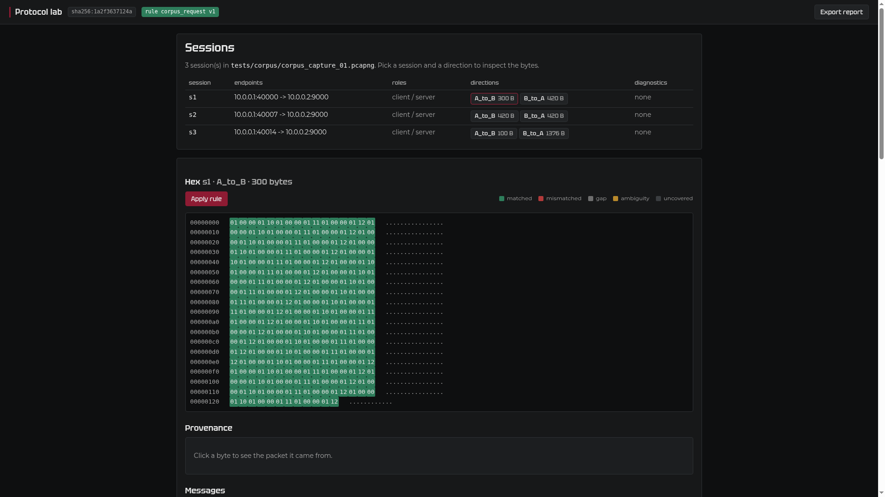

# Web interface (optional)

A small local web page over the same capture and rule engines the desktop
window uses. It is optional: the desktop application stays the primary
interface, and nothing here changes it. The web layer adds no protocol logic of
its own — it wraps `src.capture` and `src.protocol` and renders the result.

Use it when you want to look at a capture from a browser, on a machine where
PySide6 is not installed, or when you want a link to a single session.

## Install

The web stack is an extra, so a desktop install stays small:

```
pip install -e ".[web]"
```

That pulls FastAPI, uvicorn, Jinja2 and python-multipart. The base install and
the GUI do not need them.

## Run

```
python -m src.web.app --capture out/cap01.json --rule examples/corpus_rule_v1.json --port 8765
```

Then open <http://127.0.0.1:8765>.

- `--capture` accepts a normalized `*.normalized.json` file, or a raw
  `.pcap`/`.pcapng` that is normalized in memory on open.
- `--rule` is optional. Without it the bytes are still shown and framed, but no
  message is judged: every byte is `uncovered`.
- `--port` defaults to `8765`.

The server binds `127.0.0.1` only. Passing any other `--host` is refused, so the
interface cannot be exposed on the network by accident.

## Screenshot



The session list links each direction to the hex view; applying the rule turns
the byte colours into verdicts, and clicking a byte shows its origin packet.

## What it does

- Open a capture and list its sessions, with endpoints, roles and diagnostics.
- Pick a session and a direction.
- View the reassembled bytes as hex, with matched/mismatched/gap/ambiguity
  highlighting.
- Apply the rule to a direction and read the per-message verdicts.
- Click a byte to see its provenance: packet index, TCP sequence number and
  timestamp.
- Read the message list with offset, length, fields and status.
- Export the current interpretation as a self-contained HTML report.

Rendering is server-side Jinja2 with HTMX swapping fragments in place. The
stylesheet and `htmx.min.js` are served locally, so the page needs no network.

## What it does not do

By design, and to keep the scope honest:

- no rule editor or rule diff/versioning
- no metrics, charts or journal correlation
- no alternative-hypothesis search
- no theme switch (one dark theme, the brand)
- no accounts, sessions, database or persistence — all state is in memory

## Errors

A bad path, a malformed capture or an unknown session returns a plain page with
the reason, not a stack trace:

- unknown capture / bad file: HTTP 400 with the message
- unknown session or direction: HTTP 404
- an offset outside the stream: HTTP 404
- a port already in use: the process exits with a clear message on stderr

## Fonts

The page uses the same Tektur and Montserrat files that live in
`assets/fonts/`, served under `/fonts`. The web package does not keep a second
copy.

## Tests

```
pytest tests/web/ -q
```

The tests drive the FastAPI app in-process and run the real engines against the
reference corpus.
