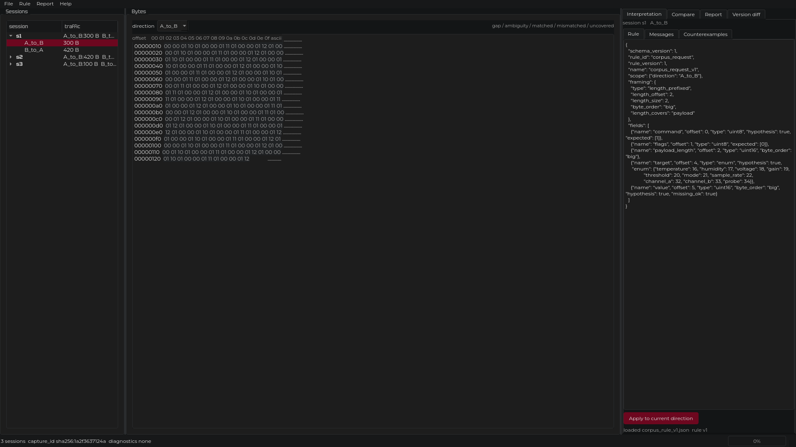
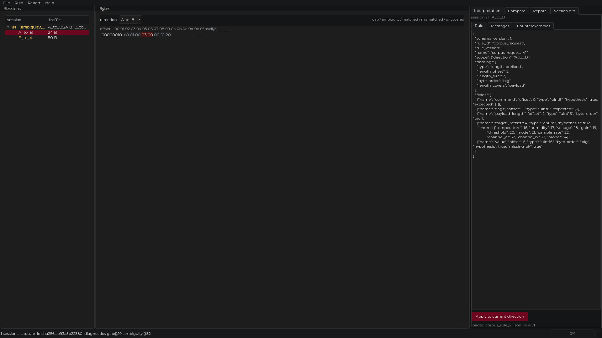
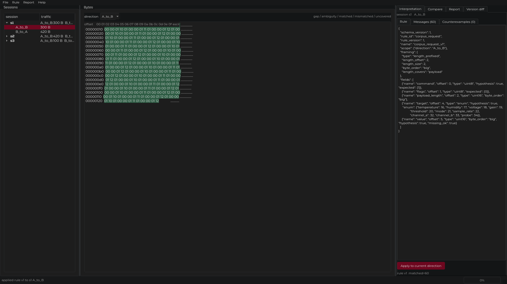
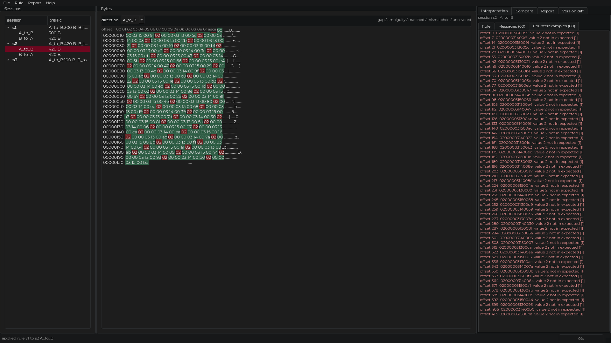
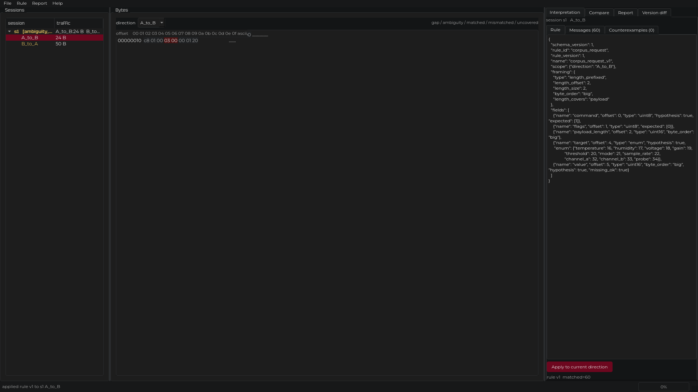
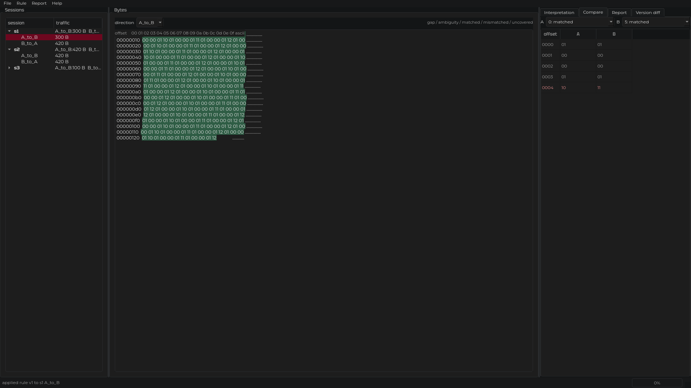
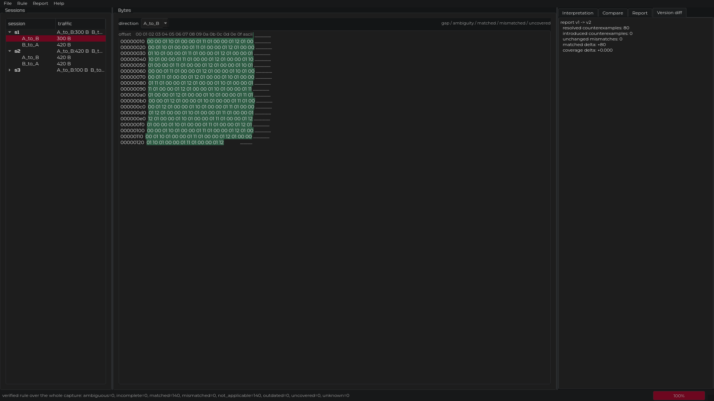
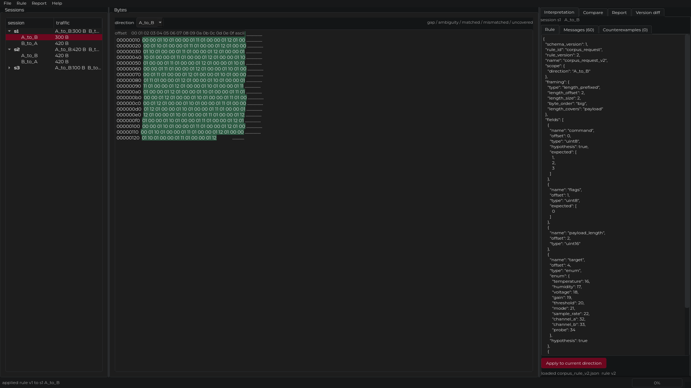

% Лаборатория протоколов
% Восстановление недокументированного бинарного протокола поверх TCP
% UMIRHack, 2026

---

# Задача

Даны захваты трафика (pcapng) и журнал действий устройства. Спецификации нет.

Нужно восстановить структуру сообщений и сохранить доказательность:

- что наблюдалось, а что предположено;
- где правило работает, а где перестаёт;
- почему один вариант чтения выбран, а другие отвергнуты.

Вход: захват и журнал. Выход: проверяемая интерпретация с контрпримерами.

---

# Подход

Три независимых модуля, связанные форматами JSON.

- Захват: читает pcapng, собирает сессии, восстанавливает поток, хранит происхождение байтов.
- Протокол и гипотезы: правила фрейминга и полей, применение к корпусу, контрпримеры, версии.
- Интерфейс: настольное окно для исследования и просмотра результата.

Форматы зафиксированы схемами JSON Schema (draft 2020-12) и не меняются молча.

---

# Захват потока

- Сессия — это экземпляр соединения, а не пара адресов. Повторное использование портов даёт новую сессию.
- Байты восстанавливаются по номерам последовательности; повторная передача даёт дополнительные сведения о происхождении, а не лишние байты.
- Пропуск в потоке не заполняется нулями. Он становится диагностикой, и сообщение поверх него помечается как неполное.
- Каждый диапазон байтов помнит номер пакета, номер последовательности и время.

Границы TCP-пакетов не являются границами сообщений.

---

# Правила и фрейминг

Правило — это декларативный JSON. Оно описывает, где заканчивается сообщение и что означают поля.

- Фрейминг: по длине, фиксированный размер, по маркерам, вручную.
- Типы полей: целые, байты, перечисления, строки, контрольные суммы, вычисляемые поля.
- Поле с пометкой `hypothesis` — это предположение о смысле, а не факт.

Одно правило описывает весь поток. Сообщения не перечисляются вручную.

---

# Гипотезы и контрпримеры

Применение правила даёт по каждому сообщению один из статусов:

- `matched`, `mismatched`, `incomplete`, `ambiguous`, `uncovered`, `not_applicable`.

`mismatched` — это контрпример. Он привязан к байтам и к пакету-источнику.

Совпадение на примерах не является доказательством. Правило проверяется на всём корпусе, а контрпримеры сохраняются, а не отбрасываются.

---

# Интерфейс

Слева сессии, в центре байты, справа применение правила и результаты, внизу происхождение байта и диагностики.

---

Сессия помечается, когда в её потоке есть пропуск или неоднозначность. Байт под полем правила подсвечен по статусу; пропуск виден отдельно.

---

# Демонстрация: цикл на корпусе

1. Наблюдение: байты запроса начинаются с `01 00 00 01`. Значение по смещению 2 укладывается в границы сообщения.
2. Гипотеза: по смещению 2 лежит длина в два байта, старший байт вперёд; сообщение — заголовок и полезная нагрузка.
3. Проверка на корпусе: правило фрейминга по длине разбирает все потоки без остатка.
4. Контрпример: правило объявляет код команды `1`, но в тех же сессиях встречаются `2` и `3`.
5. Уточнение: множество допустимых команд расширяется до `1`, `2`, `3`.
6. Повторная проверка: контрпримеров нет.

Наблюдение отделено от гипотезы на каждом шаге.

---

# Проверка и контрпримеры

Правило первой версии: допустимый код команды только `1`.

| показатель | v1 | v2 |
| --- | --- | --- |
| matched | 60 | 140 |
| mismatched | 80 | 0 |
| точность | 0,43 | 1,00 |

Пропуск не заполняется: сообщение поверх него помечается как неполное.

---

# Сравнение сообщений и версии правила

Уточнение затронуло только список допустимых команд, структура правила не менялась. Старый результат остаётся на диске со своей версией и помечается устаревшим.

---

# Воспроизводимость

- Весь разбор воспроизводится одной командой и не выдумывает данные: при отсутствии корпуса завершается с ошибкой.
- Переносимый проект: исследование копируется в другой каталог и открывается заново.
- Правила экспортируются в разбор на Kaitai Struct и в автономный модуль Python, который повторяет разбор движка.
- Есть командная строка для применения правила, проверки на корпусе и сравнения версий.

---

# Ограничения

Что не сделано и остаётся открытым:

- смысл байта флагов не установлен: в корпусе он постоянен;
- поле значения не объяснено ни одним проверенным чтением и остаётся гипотезой;
- ответы разбираются по границам, но не по полям;
- альтернативные чтения берутся из заданного набора; смысл вне набора не будет найден;
- корпус синтетический, поэтому протокол может не совпадать с реальным устройством.

Интерпретация верна для проверенных захватов и молчит вне них.

---

# Итог

- Восстановлена раскладка сообщений: код команды, флаги, длина, полезная нагрузка.
- Код команды принимает значения `1`, `2`, `3`; смещение 4 — идентификатор параметра; смещение 5–6 — значение при записи.
- Правило переносится на второй захват и не переносится на посторонний.
- Каждое утверждение подкреплено байтами, контрпримером или независимым журналом.

Готово к развитию: разбор ответов, проверка на реальных захватах, расширение набора чтений.

---

# Вопросы

Репозиторий: `Pavel1778/madrigal-protocol-lab`

Исследование целиком: `REPORT.md`, `docs/REFERENCE_INVESTIGATION.md`.

Сценарий демонстрации: `docs/demo.md`.
